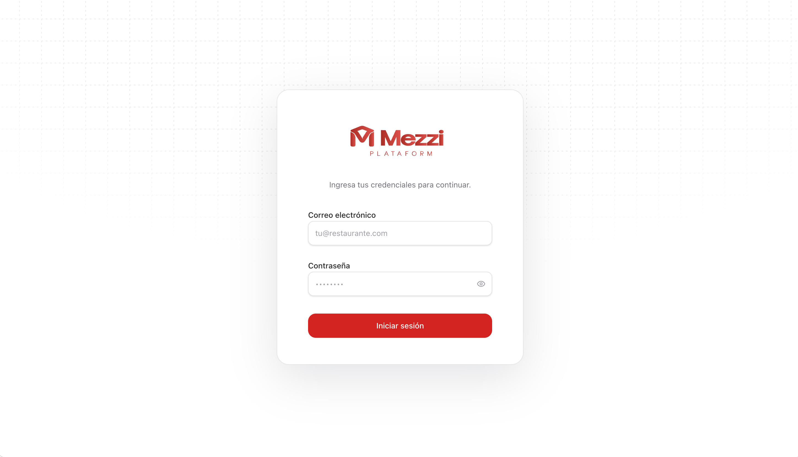
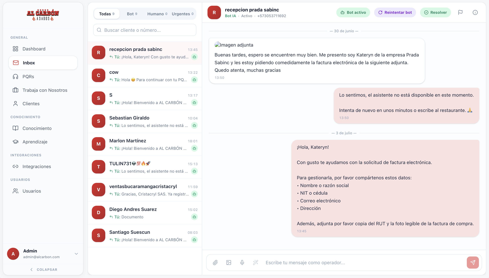
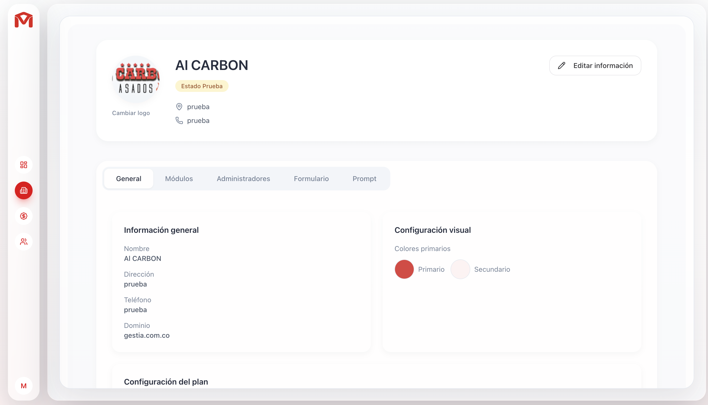

# Mezzi

**Plataforma SaaS de gestión inteligente para restaurantes.**

Mezzi centraliza la operación diaria de tu restaurante en un solo lugar: inbox omnicanal con IA, reservas, pedidos, PQRs, base de conocimiento, reclutamiento y más — todo conectado a WhatsApp.

---

## Screenshots

<p align="center">
  
</p>
<p align="center"><em>Login — Cada restaurante accede con sus credenciales a su panel personalizado.</em></p>

<br />

<p align="center">
  
</p>
<p align="center"><em>Inbox — Conversaciones en tiempo real vía WhatsApp. El bot IA responde automáticamente, escala a humano, envía documentos y gestiona PQRs.</em></p>

<br />

<p align="center">
  
</p>
<p align="center"><em>Superadmin — Panel de administración multi-tenant: configuración visual, módulos, planes, prompts y dominio personalizado por restaurante.</em></p>

---

## Funcionalidades

### Inbox Omnicanal + IA
Conversaciones en tiempo real con clientes vía WhatsApp (YCloud). Un agente IA responde automáticamente usando la base de conocimiento del restaurante, o escala a un agente humano. Soporta texto, imágenes, audio, documentos y PDFs.

### Reservas
Sistema completo de reservas virtuales (WhatsApp) y presenciales. Configuración de cupos diarios, campos personalizados, mapa de mesas con drag & drop, confirmación de llegada, no-shows y sincronización con Google Calendar.

### Pedidos
Gestión de pedidos creados desde el chat o manualmente. Seguimiento de estado (pendiente → enviado → entregado), notificación automática al cliente por WhatsApp al despachar.

### PQR (Peticiones, Quejas, Reclamos)
Captura automática de PQRs desde conversaciones. Routing inteligente por módulo y ciudad, notificaciones por email (Brevo), asignación a agentes, y seguimiento hasta resolución.

### Base de Conocimiento (RAG)
Entrena a la IA con información del restaurante: menú, horarios, políticas, promociones. Sube archivos (PDF, TXT, MD) o escribe texto directamente. El agente consulta esta base en cada conversación.

### Centro de Aprendizaje
Interfaz de chat para que el equipo del restaurante practique y valide las respuestas de la IA. Límite de 2000 créditos diarios por tenant.

### Trabaja con Nosotros
Gestión de vacantes por ubicación/ciudad. El bot detecta intención de empleo y recopila datos del candidato automáticamente.

### Clientes (CRM)
Perfil automático por cliente: nombre, email, preferencias, historial de contacto. Se alimenta de las conversaciones y se usa como contexto para la IA.

### Multi-tenant + Superadmin
Arquitectura multi-restaurante con roles (Owner, Admin, Agent, Viewer, HR), permisos por página, planes de suscripción, colores y logo personalizados, y panel de superadministración completo.

### Integraciones
- **WhatsApp** vía YCloud (webhook + API)
- **Google Calendar** (OAuth, sync bidireccional de reservas)
- **ElevenLabs** (transcripción de audio)
- **Brevo** (notificaciones email de PQRs)
- **PDFs** enviables por WhatsApp (menú, promociones, decoraciones)

---

## Tech Stack

| Capa | Tecnología |
|------|-----------|
| Frontend | Next.js 16, React 19, Tailwind CSS 4, shadcn/ui |
| Backend | Convex (serverless, real-time) |
| IA | OpenAI GPT (agents + RAG + tool calling) |
| Mensajería | YCloud (WhatsApp Business API) |
| Auth | Email/password con bcrypt (Convex) |
| Monorepo | Turborepo + Bun |

## Arquitectura

```
mezzi/
├── apps/
│   ├── web/          # Next.js (frontend)
│   │   ├── app/
│   │   │   ├── login/           # Auth
│   │   │   ├── superadmin/      # Panel superadmin (planes, restaurantes, usuarios)
│   │   │   ├── tenants/         # Panel restaurante
│   │   │   │   ├── inbox/       # Conversaciones WhatsApp + IA
│   │   │   │   ├── reservas/    # Reservas + mapa de mesas
│   │   │   │   ├── solicitudes/ # Pedidos
│   │   │   │   ├── pqrs/        # Quejas y reclamos
│   │   │   │   ├── clientes/    # CRM
│   │   │   │   ├── menu/        # Gestión de menú
│   │   │   │   ├── knowledge/   # Base de conocimiento
│   │   │   │   ├── aprendizaje/ # Centro de aprendizaje IA
│   │   │   │   ├── trabaja-con-nosotros/ # Vacantes
│   │   │   │   ├── integraciones/ # YCloud, Google Calendar
│   │   │   │   ├── users/       # Usuarios del restaurante
│   │   │   │   └── ajustes/     # Configuración
│   │   │   └── form/[token]/    # Formulario público de onboarding
│   │   └── components/
│   └── backend/      # Convex (serverless)
│       └── convex/
│           ├── system/ai/       # Agentes IA, RAG, tools
│           ├── system/ycloud.ts # Webhook WhatsApp
│           └── ...              # Módulos: auth, reservas, pedidos, PQR, etc.
└── turbo.json
```

## Setup

```bash
# 1. Instalar dependencias
bun install

# 2. Configurar Convex (primera vez)
cd apps/backend && npx convex dev

# 3. Copiar variables de entorno
cp .env.example .env

# 4. Desarrollar
bun run dev
```

- **Web:** http://localhost:3000
- **Convex:** se sincroniza en la nube automáticamente

---

Hecho con Next.js, Convex y mucha salsa.
